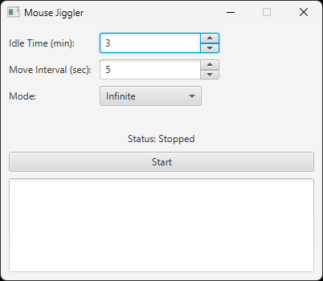

# MouseJigglerApp

The Mouse Jiggler App is a lightweight Java Swing application that prevents your computer from going idle by simulating small, periodic mouse movements. This is useful for keeping your system active, preventing screen lock, or avoiding automatic logouts due to inactivity.

## Features
- Automatically moves the mouse cursor at set intervals.
- Minimalist and user-friendly interface.
- Low resource consumption.
- Prevents "Away" status on communication apps.

